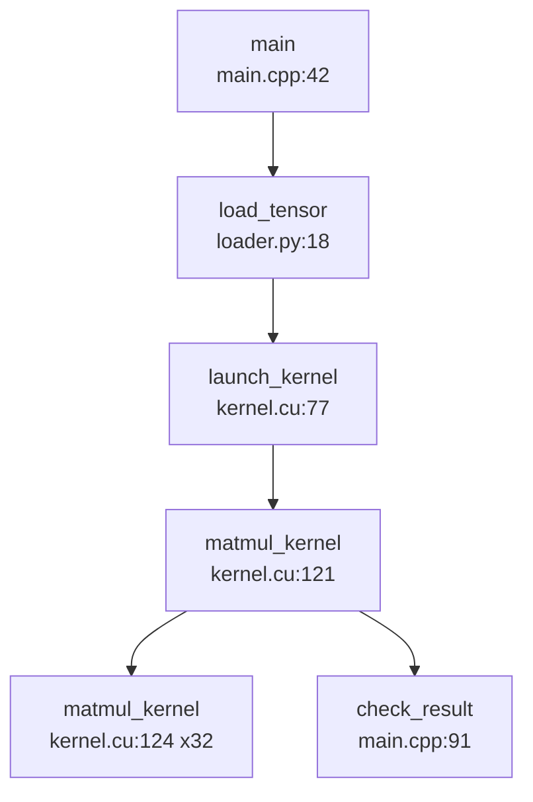

# Debug Flow Trace Tool 设计方案

## 目标

构建一个源码阅读辅助工具：当用户在 VS Code 中正常调试代码时，工具自动记录实际执行路径。它需要支持 Python、C++ 和 CUDA 调试场景，记录走过的函数、源码位置和调用关系，并把这些信息渲染成可回顾的流程图。

## 产品形态

第一版应该做成旁路记录器，而不是替代 VS Code 调试器。

用户仍然使用 VS Code 里已有的 debug 配置。工具作为一个透明的 Debug Adapter Protocol 代理，插在 VS Code 和真实 debug adapter 之间。它观察调试命令和暂停事件，向 adapter 查询当前调用栈，然后把标准化后的 trace event 写入本地 session 文件。

```text
VS Code
  |
  | Debug Adapter Protocol
  v
Trace Proxy
  |
  | Debug Adapter Protocol
  v
Real Debug Adapter
  |
  v
debugpy / cppdbg / cuda-gdb-backed adapter / lldb adapter
```

这个方式可以保留用户熟悉的调试体验，同时让同一个记录器覆盖多种语言和调试器。

## 目标平台

- Linux
- WSL
- macOS

核心能力不应绑定特定平台 UI。工具应作为本地 CLI 进程运行，并输出本地文件或提供 localhost viewer。等核心 trace 格式稳定后，再做 VS Code 集成。

## 第一版不做什么

- 不替代 VS Code 的调试 UI。
- 不静态还原源码中所有可能的分支和循环。
- 不通过自定义 Web UI 控制 step/next/continue。
- 不承诺完整重建 CUDA block/thread 语义。
- 不做全程序调用图分析。

第一版只记录用户调试过程中实际走过的运行路径。

## 架构

### Trace Proxy

Trace Proxy 是 VS Code 使用的入口。它启动或连接真实 debug adapter，双向转发 Debug Adapter Protocol 消息，并记录其中有价值的消息。

职责：

- 不改变行为地转发所有 DAP request、response 和 event。
- 识别 `next`、`stepIn`、`stepOut`、`continue`、`pause` 等调试命令。
- 通过 `stopped` event 识别程序暂停。
- 暂停后主动发起或复用 `threads` 和 `stackTrace` 请求，采集当前源码位置和调用栈。
- 附加 session 元数据，例如 adapter 类型、workspace root、launch 配置、操作系统和时间戳。

Proxy 应尽量 fail open。即使 trace 记录失败，底层 debug session 也应该继续可用。

### Debug Adapter 支持

第一批支持的 adapter：

- Python：`debugpy`
- C++：VS Code `cppdbg` 或其他兼容 DAP 的 gdb/lldb adapter
- CUDA：优先走兼容 DAP 的 cuda-gdb 路径；后续再加原生 gdb/cuda-gdb helper 来补充更丰富的数据

DAP 是公共路径。原生调试器集成是扩展点，不是第一版设计的基础。

### Trace Core

Trace Core 接收标准化事件，并推导出紧凑的执行流程图。

核心概念：

- `TraceSession`：一次调试会话。
- `TraceEvent`：一次观察到的调试动作或暂停。
- `SourceLocation`：文件、行、列、函数、模块、语言。
- `StackSnapshot`：暂停时的有序调用栈。
- `FlowNode`：流程图里的函数或源码位置节点。
- `FlowEdge`：两个节点之间的转移关系。
- `ThreadTrack`：单个线程内的执行序列。

Trace Core 应推导常见源码阅读关系：

- 函数进入：调用栈变深，top frame 变化。
- 函数返回：调用栈变浅。
- 普通单步：top frame 仍在同一函数中，但源码位置变化。
- 分支：同一个节点后续出现了不同的下一个节点。
- 循环：同一条边或同一位置重复出现并超过阈值。
- 线程切换：暂停线程发生变化。

这些推导应是显式且可检查的。即使后续图推导算法调整，原始 trace 仍然保留。

### Trace Store

第一版使用 append-only JSONL 保存原始 trace events，并额外输出派生后的 graph JSON 文件。

每次 session 推荐输出：

```text
.coderead-traces/
  2026-05-05T10-30-12-session/
    session.json
    events.jsonl
    graph.json
    graph.mmd
```

JSONL 易读、易 diff、适合流式写入，并且进程异常退出后也更容易恢复。等查询需求变复杂后，再考虑 SQLite。

### Graph Engine

Graph Engine 负责把标准化 trace events 转成可渲染的图数据。

第一版输出格式：

- Mermaid flowchart：方便放进 Markdown 回顾。
- JSON graph：供本地 viewer 使用。

图生成规则：

- 节点标签包含函数名、文件 basename 和行号。
- 重复边折叠成 `xN`。
- 分支表示为同一个节点的多条 outgoing edges。
- 循环在重复次数超过阈值后表示为回边或折叠后的 loop 节点。
- 线程切换可以表示为独立 lane，或者在边上做 annotation。

Mermaid 示例：



### Viewer

第一版 viewer 可以是读取 `graph.json` 的本地静态页面，或者一个 localhost Web UI。

最低功能：

- 展示执行流程图。
- 展示按时间排序的 event list。
- 选中图节点后显示文件、行号、函数、线程、时间戳。
- 支持链接或复制源码文件路径和行号。
- 支持折叠重复循环边。
- 支持按线程过滤。

VS Code WebView 集成应该放在 Web viewer 变得可用之后。

## 数据模型

### Trace Event

```json
{
  "id": "evt_000001",
  "session_id": "sess_2026_05_05_103012",
  "timestamp": "2026-05-05T10:30:12.481Z",
  "adapter": "debugpy",
  "event_type": "stopped",
  "reason": "step",
  "command_before_stop": "next",
  "thread_id": 1,
  "top_frame": {
    "function": "forward",
    "file": "/repo/model.py",
    "line": 81,
    "column": 5,
    "language": "python"
  },
  "stack": [
    {
      "function": "forward",
      "file": "/repo/model.py",
      "line": 81,
      "column": 5,
      "language": "python"
    }
  ],
  "metadata": {}
}
```

### Flow Node

```json
{
  "id": "node_model_py_forward_81",
  "kind": "function_location",
  "function": "forward",
  "file": "/repo/model.py",
  "line": 81,
  "language": "python",
  "hit_count": 4
}
```

### Flow Edge

```json
{
  "from": "node_model_py_forward_81",
  "to": "node_kernel_cu_launch_77",
  "kind": "call_or_step",
  "count": 1,
  "thread_id": 1,
  "evidence_event_ids": ["evt_000013", "evt_000014"]
}
```

## CUDA 和原生调试策略

CUDA 支持应先沿用 C++ 调试的 DAP 路径。数据模型需要从一开始预留 CUDA 元数据字段：

- host/device 执行侧
- kernel name
- block index
- thread index
- warp 或 lane，如果可获取
- device id，如果可获取

如果 DAP adapter 第一版无法暴露这些信息，可以先留空。后续通过 gdb/cuda-gdb helper 查询调试器专有状态，再增强 stopped events。

潜在增强路径：

- 在 gdb 或 cuda-gdb 中加载 gdb Python extension。
- extension 通过 socket 或文件输出额外 JSON events。
- Trace Core 按 timestamp 和 thread/frame 将这些事件与 DAP stopped events 合并。

这样可以避免 MVP 被 CUDA 调试器细节阻塞。

## VS Code 使用方式

第一版可用流程应类似：

```bash
coderead trace --adapter debugpy --real-adapter "python -m debugpy.adapter"
```

然后用户在 VS Code debug 配置中把 adapter 指向 Trace Proxy，而不是直接指向真实 adapter。后续 VS Code extension 可以自动生成这些配置。

未来 launch configuration 形态示例：

```json
{
  "name": "Python with CodeRead Trace",
  "type": "coderead-debugpy",
  "request": "launch",
  "program": "${file}",
  "traceOutput": "${workspaceFolder}/.coderead-traces"
}
```

## 错误处理

- 如果 graph 生成失败，原始 events 仍然要写入。
- 如果额外 stack 采集失败，记录 error event 并继续转发 DAP 流量。
- 如果真实 adapter 退出，proxy 尽量使用相同状态退出。
- 如果 trace output 无法写入，在日志中通知用户，但保持 debugger forwarding 可用。
- 如果遇到未知 DAP message，原样转发。

## 测试策略

测试应优先围绕确定性的协议 fixture 分层构建。

- DAP framing 和消息转发的单元测试。
- trace event 标准化的单元测试。
- graph inference 单元测试：线性 step、函数进入/返回、分支、循环、线程切换。
- 使用小型 Python 脚本和 `debugpy` 的集成测试。
- 在环境可用时，使用小型 C++ 程序和兼容 DAP 的 gdb adapter 做集成测试。
- Mermaid 输出的 golden-file 测试。

CUDA 集成测试应作为可选、环境门控的测试，因为 CUDA 硬件和 cuda-gdb 可用性不稳定。

## 里程碑

### 里程碑 1：Trace 格式和图推导

- 定义 session、event、node、edge schema。
- 基于合成 events 实现 graph inference。
- 生成 Mermaid 和 graph JSON。

### 里程碑 2：DAP Proxy

- 实现 DAP message framing。
- 转发 VS Code 到 adapter，以及 adapter 到 VS Code 的双向流量。
- 记录 stepping commands 和 stopped events。
- 暂停后查询 stack trace。

### 里程碑 3：Python MVP

- 通过 proxy 支持 debugpy。
- 记录正常 step/next/continue 调试过程。
- 生成 `events.jsonl`、`graph.json` 和 `graph.mmd`。

### 里程碑 4：C++ gdb MVP

- 支持兼容 DAP 的 C++ adapter。
- 验证函数进入/返回和源码位置采集。
- 编写 VS Code launch configuration 文档。

### 里程碑 5：Viewer

- 构建读取 `graph.json` 的本地 viewer。
- 增加 timeline、graph node 详情和 loop folding。

### 里程碑 6：CUDA 增强

- 验证 cuda-gdb-backed DAP 行为。
- 如果 DAP 数据不足，增加可选 native cuda-gdb helper。
- 在可获取时填充 CUDA metadata 字段。

## 待确认决策

- 第一批 C++ 支持应以哪个 VS Code C++ adapter 为目标。
- 第一版 viewer 应做成静态 HTML，还是小型 localhost server。
- 在开发 VS Code extension 之前，需要做多少 launch configuration 自动化。

## 推荐路线

MVP 用 Python 实现，因为 Python 在 JSON、subprocess、socket 和 debugger 生态上都更方便。schema 和 graph engine 保持语言无关；如果后续性能分析显示确有需要，再把性能敏感部分迁移到 Rust。

第一阶段先证明完整链路：

```text
VS Code 调试动作 -> DAP Proxy 捕获 -> trace event -> graph inference -> Mermaid 输出
```

链路跑通后，再依次加入 C++/gdb 和 CUDA 专用增强。
